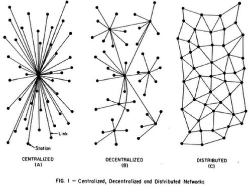

Distributed systems require a mental approach of abstraction that newcomers find challenging.
From my work with unvisersity students, the following describes the basics and concepts around distributed systems.

## Introduction

The abstraction of distributed systems has become more prevalent as services like [Amazon AWS](https://aws.amazon.com/), [Google Cloud](https://cloud.google.com/), and [Microsoft Azure](https://azure.microsoft.com/en-us/) take the reigns away from developers and let them focus more on the application. These services offer a plethora of benefits, such as scaling tasks on demand and tolerating network issues. There is no argument that this cooperative reliance isn’t beneficial for both sides, however, developers need to adjust and stop thinking sequentially and start thinking distributively. A traditional mindset adheres to the sequential single node application to solve today’s problems. That’s not the case anymore. Today’s problems involve an [exponentially growing number of clients](https://futurism.com/by-2020-there-will-be-4-devices-for-every-human-on-earth); users utilize multiple devices, such as their laptop, desktop, phone, tablet, etc. In this piece, I’ll be taking a look at what developers need to consider when transitioning to this new way of computing.

## What Does it Mean to be a Distributed System?

A distributed system is the abstraction of a network of nodes to act as a single machine. Such a system allows for reduced computation time on massive data sets, ones that would typically overwhelm and render a single machine useless (in terms of user expectation to complete a task). There are two types of distributed systems: centralized and decentralized systems.

In the past, the terms parallel, concurrent, and distributed computing have largely been considered synonymous. Parallel and distributive computing differ on a very important point. Parallel computing involves processes using shared memory, whereas, in a distributed system, each node has its own local memory. This eliminates the need for explicit locks on shared resources.

## An Abstraction

A simple single node computation is sequential, processing each step after the previous one and handling events as they arise. If a program were to be replicated and execute at the same time on this single node, then those two processes would be executing in a parallelized state (seemingly — the scheduler flips between processes so fast it appears parallel). Instead of replicating the process, let's take that idea and throw in a [thread](https://en.wikipedia.org/wiki/Thread_(computing)) to our [process](https://en.wikipedia.org/wiki/Process_(computing)). A thread is able to divert functionality away from the main sequence of execution and operate in a seemingly [parallel](https://en.wikipedia.org/wiki/Parallel_computing) state within the single process. This is what we would call [multi-threaded](https://en.wikipedia.org/wiki/Thread_(computing)#Multithreading) programming.

Instead of a thread, we fork a process from the main process and make it a sub-process. The difference between a thread and a process is that a thread is the smallest set of instructions that a scheduler can manage. A process is a larger set of instructions which threads are typically sub-components of. Imagine that our process invokes a sub-process which operates on a set of data to return a value, all the while our main process is operating in its own time-space.

Let’s take it one step further. If we move this sub-process to its own process, we now have two processes that operate independently of each other. This isn’t useful to us unless we suggest that these two processes still need to communicate over some information. [Inter-process communication (IPC)](https://en.wikipedia.org/wiki/Inter-process_communication) ([paper](https://link.springer.com/content/pdf/10.1007/BF01786228.pdf)) is the protocol for allowing separate processes to operate on some shared data.

Finally, let’s remove this process from our single node and place it on a new distinct node. Instead of communicating over an IPC, we are going to need a new message passing system. This brings us to [remote procedure calls (RPC)](http://www.cs.princeton.edu/courses/archive/fall03/cs518/papers/rpc.pdf). RPC’s allow us to transfer control and data across a network. Let’s consider our main process and its need for a value. Our main process will submit an RPC to our second node with the task it wishes for it to complete and any complementary arguments necessary. Once submitted, our main process can continue operating as it normally would. Once our second node has completed its task, it will reply back with the value and any other relevant information about its operation.

Two nodes aren’t really exciting. Let’s suggest that our main node is a primary node (the node in charge) and our secondary node, along with as many nodes as necessary, are workers (computation nodes) for our primary node. At the moment, for simplicity sake, let’s consider only one primary node (we will talk about failures later). Say we have a 10TB data set to operate on, our single node view would either crash or operate so slowly that it would appear to have crashed. This is where the distribution of tasks comes into play. Our primary node only needs to organize and delegate tasks to worker nodes, who return results before being given the next task to work on. Suppose we have 100 workers; 10TB would still be a lot to work through, but it would have a more reasonable execution (this indirectly refers to a [service-level agreement (SLA)](https://corescholar.libraries.wright.edu/cgi/viewcontent.cgi?article=1077&context=knoesis)). That is a distributed system (on a centralized network).

## IPC to RPC

In the above abstraction, we evolved from IPC to RPC for communication between processes. Consider the IPC that utilizes shared memory between processes on a single node, we compare this to RPC which exists in a different address space (usually distinct nodes). Invoking IPC calls to shared memory is a form of distribution, say two distinct nodes operating on the same database/server. The two processes are distinct but operating on a local-esque network involving procedures/protocols on how they are allowed to continue. However, instead of managing a middle medium, RPCs are used to directly communicate with that other process to request/send information. Usually, a process invoking an RPC is only using its local memory space and passing parameters over a communication link. It should be noted that RPCs can, in fact, be used on the same node between distinct processes — there are some advantages to that.

The movement from IPC to RPC allows distributed system designers to eliminate the need for semaphores and locks ([and other types of IPC](http://csweb.cs.wfu.edu/~torgerse/Kokua/More_SGI/007-2478-008/sgi_html/ch02.html)) over shared memory. This frees up computation from a lock-step time order and into concurrent operation. So far we’ve considered shared memory IPCs. There is another type of IPC that involves message passing. This is where RPC stems from.

Across a network, invoking an RPC allows the calling process to potentially (depending on the nature of the call) continue operating while the callee is receiving and processing the request. This increases the performance of the distributed system in terms of concurrent progress.

By implementing an RPC, the difficulties of communication are removed and all that is left is the distributed system difficulties of [timing, independent failure of components, and the coexistence of independent execution environments](http://www.cs.princeton.edu/courses/archive/fall03/cs518/papers/rpc.pdf).

## Concurrency Versus Parallelism

Earlier, we referred to parallelism with threads. However, this is not how a distributed system works, since there are subtle differences in the definitions of these words. A distributed system is not parallel, but it is concurrent. The difference, outlined [here](https://docs.oracle.com/cd/E19455-01/806-5257/6je9h032b/index.html), is that parallel processes execute simultaneously whereas concurrent processes make progress at an undetermined rate. Workers may be given tasks that vary in computational expense, so for workers to operate in parallel, the system would be bottlenecked by its slowest worker per each round of subset of tasks. Concurrently, workers can operate more efficiently (as the system) as workers who have completed tasks may receive new tasks, whereas slower workers (although still the limiting factor) can continue processing their task.

## Distributed Systems

By definition, [a distributed system is one that is fully connected](https://www.geeksforgeeks.org/comparison-centralized-decentralized-and-distributed-systems/) (if realized as a graph). This is not always possible, that is why there is a [range of being centralized to be fully connected that can be called a distributed system](https://www.ibm.com/support/knowledgecenter/en/SSAL2T_8.2.0/com.ibm.cics.tx.doc/concepts/c_wht_is_distd_comptg.html). To define a system by its structure is more of a business approach. Computationally, a distributed system is the passing of tasks to reach an improved computational performance to solve a global goal. [Google defines](http://www.hpcs.cs.tsukuba.ac.jp/~tatebe/lecture/h23/dsys/dsd-tutorial.html) a distributed system as follows:

 > A distributed system is an application that executes a collection of protocols to coordinate the actions of multiple processes on a network, such that all components cooperate together to perform a single or small set of related tasks.

 The benefits of distributed computing allow for horizontal scaling. [Horizontal scaling](https://github.com/vaquarkhan/vaquarkhan/wiki/Difference-between-scaling-horizontally-and-vertically) is where when demand increases on the system, more nodes are added to balance and take the increased load.

## Centralized Distributed Systems

 

As in our example above, a centralized system is one that contains a central primary node that delegates to the workers on the network. This is still a type of distributed system since it is still distributing workloads over the network to achieve better computational performance.

## Decentralized Distributed Systems

A decentralized system is one where each node operates independently of any primary— they are each primary in their own right. Each primary may be part of a centralized network where it has workers. Regardless of the substructure, each node is able to communicate with one another, but without a strict agreement to delegate tasks (as like in a centralized system) some level of consensus on how to reach the goal proposed to the network is required.

## A System in Motion

Suppose we’ve built our distributed system and it’s up and running. In a perfect world, this system will run without fault or failure. In a perfect world, the [eight fallacies](http://www.hpcs.cs.tsukuba.ac.jp/~tatebe/lecture/h23/dsys/dsd-tutorial.html) of distributed systems would be true and everything would be great:

- The network is reliable
- Latency is zero
- Bandwidth is infinite
- The network is secure
- Topology doesn’t change
- There is one administrator
- Transport cost is zero
- The network is homogeneous

Unfortunately, this isn’t true. A system in the real world has to be more robust and handle the opposite of each of those fallacies (and more).

Let's start with a running system which is communicating successfully. Messages containing values, operations, and states are being sent and received by all nodes. There is a notion of consistency with this communication principle that tackles the issue of making sure all nodes contain the same information that the others do. This is important because nodes and network links are not reliable and do fail. The failure could be in the software or hardware, but either way, the failure renders a node inaccessible to the rest of the network. The common practice is to restart the node process if it is the node that failed. Seems simple enough, however, in the time the node was down and out of the network, the environment changed. This is also true if the network link failed and the node was partitioned and had to wait for the communication to be reestablished. During that time, new values, data, and operations were processed by its neighbors. This failed node now has to catch up somehow. There are have been protocols built to accommodate this scenario, such as Paxos’ catch-up methodology. The failed node needs a way to gather the most recent information so it is consistent with the rest of the network.

## Consistency

If the rest of the network has kept consistent with up to date information, the failed node may request this information from where the governing protocol allows. Paxos, Raft, and 2-Phase Commit (2PC) are mechanisms for ensuring consistency through consensus and offer methods to bring failed nodes back up to date. 2PC is known as an atomic commit protocol (APC), which means that for information to be committed, it must be committed by all of the peers on a network. Atomic commitment protocols are known as “strong consistency” models, but there are “weak consistency” models that exist in consensus protocols.

Paxos is a consensus protocol in which a majority of nodes must agree on a value to be committed to history/log and Raft extends this by introducing the importance of order to the commitments. Other protocols incorporate what is known as “eventual consistency” or “optimistic replication”. What this means is that if a value is no longer written to, then with consecutive reads, it will eventually propagate throughout the system until all nodes contain this latest value and are therefore consistent. The problem with eventual consistency, although used successfully in practice, is that the amount of time required to reach consistency is unknown and unbounded.

A popular method for achieving consistency is the use of logs (or history). These logs are either replicated throughout the system (as in atomic protocols) or written to as the majority of nodes reach consensus on the information. When nodes recover and try to catch up to the system’s most up to date information, it is these logs that are referenced and shared.

## Availability

Through these failures and fixes, the nodes are expected to be available for the running protocol to communicate to. When a node is not available, the network can come under a few conditions. A network may no longer be large enough to obtain a majority of votes (as used in Raft) to reach consensus and therefore stops functioning until the network link or node failure is fixed. An unavailable node may rejoin the network and be inconsistent — if left unchecked it could potentially propagate stale information over the network (which is why the idea of consistency was introduced above).

Considerations into how a node rejoins the network must be implemented as not to disrupt the system operation. As long as the rest of the system has been consistent, then recovery of the rejoining node should be fairly straight forward and the same mechanisms covered in the section on consistency can be utilized for the recovering node. This concept of unavailable nodes falsifies the statement that the topology of a system does not change. In the case where new nodes are added (not recovering) to a system, the same mechanisms of recovering a failed node can be applied to bring the new node up to date and available for work.

## Partition Tolerance

As mentioned earlier, network link failures can happen and as with single nodes rejoining a network, considerations into how a partition recovers back into the full network must be designed. Sometimes network failures are bad enough that they cause a partition to occur, splitting a single network into two. The protocols mentioned have mechanisms to recover consistency across the network once it’s established, but the consideration to what happens from the time of the partition until the network is resolved must be taken into account. The Raft protocol will only continue to operate on a partition if the partition contains a majority of peers. This enables consensus to be reached on information. If a majority does not exist on a partition, in Raft, that partition ceases to operate and waits for recovery to occur. However, if the network was large enough that a majority can exist on both sides of the partition, recovering back into a full network becomes more complicated.

## CAP Theorem

The concepts of consistency, availability, and partition tolerance wrap together into what is known as the [CAP Theorem](https://dspace.mit.edu/bitstream/handle/1721.1/79112/Brewer2.pdf?sequence=1&isAllowed=y) (C: Consistency; A: Availability; P: Partition tolerance). This theorem is well known in the distributed systems community and suggests that only two of the three scenarios may exist at any given time, so it can either be a CA, AP, or a CP system. In recent years with the emergence of geographically distributed data centers, CA systems are only valid in small local networks and do not tolerate partitions. Since the network is small enough, it may not need to handle such failures (though, it should). Partition tolerance has become a common practice and should be considered when building a distributed system. Since the consistency of a system can aid in the recovery of unavailable nodes becoming available and useful to the system again, it could be considered that the CAP Theorem is only the CP Principle now.

## Homogeneous Networks

As seen above, there are multiple protocols (2PC, Paxos, Raft, etc) and architectures for a network to operate with. However, a network is not limited to using only one protocol. Considerations must be taken to realize a system which utilizes one or more protocols. To tackle this concern, the notion of interoperability, which is the ability of a system to communicate information across different types of systems, is utilized.

## Caching

Most logs are written to files in order to have non-volatile storage of important information. However, I/O operations can be costly, so caching is implemented into most distributes systems. Caching keeps important information in local memory that can be accessed quickly, while also writing it to storage concurrently. Implementing caching prevents bottlenecking of performance when low latency is important as not to incur timeouts throughout the network.

## Service-Level Agreement (SLA)

An SLA refers to the [expected level of service between the consumer and the provider](https://corescholar.libraries.wright.edu/cgi/viewcontent.cgi?article=1077&context=knoesis). What this means is the user expects a certain level of a particular set of system metrics to be upheld in order for the system to be usable. These metrics could involve performance (latency and throughput of tasks), consistency of the data across nodes, availability of workers and service, fault tolerance, scalability of workers, etc.

## [Containerization](http://doras.dcu.ie/20642/1/CCM-2015-Pahl-Containers-PaaS-Cloud.pdf)

With the introduction of container technology, implementation and deployment of distributed systems have made another shift. A container is able to host the local requirements of the implementation without having it be required on any host machine it is deployed to. Each container is isolated from the host architecture and is capable of communicating via RPC. As such, this does not disrupt any foundations already implemented but acts to increase control over the environments which implementations are deployed to. It is a lightweight solution to virtualization.

## Debugging

Since a distributed system is just that — distributed, typical means of isolating and replicated issues in order to determine bugs becomes difficult.

### Logging

The extensive use of logging in a distributed system is a key element to solving issues that are not intuitive or obvious. Nodes can be designed so they log failures and/or behavior that could be useful in determining system bugs. These nodes can send these reports back to the priamry/client (though the issues of network failures occurring when this happens are still prevalent).

### Profiling

Sometimes the issue lies in the performance of a system. Profiling implementations to isolate heavy computational cost areas can prove useful in order to consider refactorization or patches to be pushed

## Conclusion

Shifting mindset from single sequential computing into distributive concurrent computing requires more considerations for the various design nuances that accompany the nature of the distribution. Understanding how processes are distributed and their abilities to communicate are the basis for implementing a system. Introducing recovery and consistency mechanisms improve the stability of the system when failures occur. Utilizing techniques to satisfy SLAs help develop a usable system. These concepts are at the core of approaching distributed systems as a developer.