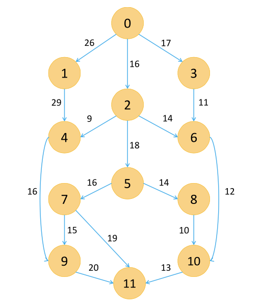
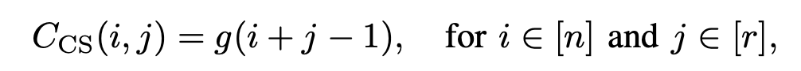
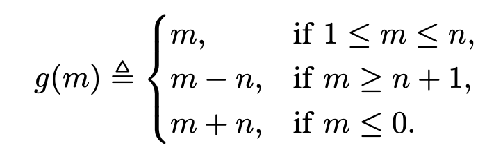
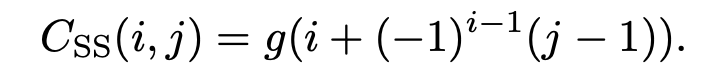

Curating the scheme of task allocation and its impact on the system.

> Scheduling is a decision-making process that is used on a regular basis in many manufacturing and services industries. It deals with the allocation of resources to tasks over given time periods and its goal is to optimize one or more objectives.[1]

Implementing a distributed system requires cost for hardware support and agreements on service expectations. Optimizing tasks through proper scheduling helps reduce the overall cost of computation while increasing the value customers receive.

## Architecture

Stepping outside the realm of individual compute nodes (personal computers for example) and into the domain of distributed systems we need to consider how these compute nodes communicate with each other.

A system is centralized when it contains a center node that performs the necessary delegations to other nodes — this node is referred to as the primary node. The other, delegated, nodes are considered workers. Decentralized distributed systems offer a more obscure abstraction of primary/worker relations as a node may be a primary of a centralized subset of the network, or exists simultaneously as the primary and worker. The primary nodes communicate between each other in order to achieve the system goal.

A third type of distributed system architecture falls into a hierarchical structure. This hierarchical distributed system offers a tiered layer where a node may communicate with only its predecessor or successor (either one level above or below).

The organization of the architecture may play a role in the scope of the scheduler. Not only should we consider the architecture connectivity of primary, workers, and their resources but also policies and access controls when implementing a scheduler. In a cloud based environment, these access controls limit the network and physical resources a worker can communicate with.

## What are Tasks?

A task is a logical unit that makes progress toward a unified goal of a system. One such set of tasks could be images that a distributed model is learning or predicting on. Another such set of tasks could be a set of computations offloaded to multiple nodes in small chunks and sent off to workers to be computed. A task may end at the worker node — perhaps a state change — or a response may be communicated back to the primary. There are two types of tasks: dependent and independent.

Dependent tasks rely on the response from a task ahead of itself before they can be executed. These tasks are better suited for a synchronous system that waterfalls from one task to the next depending on dependency. The system makes progress at a more determinable rate due to the predictive analysis of task succession.

Independent tasks can be run in parallel and/or concurrently. These tasks run best in an asynchronous system. The downfall to consider is resource contention if a particular set of tasks require the same network resource (say, accessing a database value) — this situation has workarounds: eventual consistent databases/servers. The system makes unified progress at an undetermined rate as tasks may run simultaneously toward the system goal.

## Task Allocation Through The Scheduler

The process of managing task allocation, to where and to who, is the responsibility of a scheduler. The scheduler of a distributed system performs akin to the process scheduler on any operating system.

Scheduling tasks from the primary to workers can occur at multiple stages. There can be global scheduler that directs all tasks to all connected workers. There can also be local schedulers that handle incoming and outgoing tasks/replies on both the primary and worker nodes. Organizing this dynamic scale of events is a major component of the systems efficiency. In a centralized distributed system, it is more common to see a global scheduler managing the allocation of resources and tasks between primary and workers. However, in a decentralized distributed system, there may exist multiple schedulers that are responsible for part of the overall system. Management of this decentralized state may be distributed over resources. Each scheduler in a decentralized system can be considered the same as the scheduler of a centralized system.

## Cloud-Based Scheduling

Infrastructure as a Service (IaaS), Software as a Service (SaaS), and Platform as a Service (PaaS) are common models for user services and each have their own scheduling requirements.

IaaS — the most popular in cloud environments — offers physical and virtual environments to deploy computations and/or applications at scale on a public or private based setting. Some of these features are restricted through access controls that are subject to cost-per-use or subscription-based. For IaaS, the scheduler is responsible for “allocating virtual machine requests on the physical [architecture]”. For PaaS and SaaS, the scheduler is responsible for allocating the aforementioned applications and/or computational chunks to workers in order to be executed/served.

Part of optimizing the objectives of cloud-based scheduling includes the Service Level Agreement (SLA) of users with their end clients (workers). The throughput and latency of a system directly affects a users first and third party SLA agreements — these SLA agreements can be synonymous to Quality of Service (QoS) expectations.

To achieve high SLA/QoS, a scheduler needs to be robust in order to reduce execution time and cost. A robust scheduler must be able to handle a change in application topology (new instances dynamically being add and removed from the pool), resource/software configurations, input data, and data sources. This is not a comprehensive list of possible dynamics a scheduler should be robust to. One of the biggest nuances of distributed systems is the ability of a schedulers robustness against failure occurrences.

Handling failure occurrences is a major proponent of distributed systems. The scheduler must be able to salvage, redistribute, and/or re-implement these occurrences in order to maintain system QoS. Granted, if a failure occurrence is large enough, there will be interruptions in service. However, if a failure occurrence is small scale and handled properly, an end user may never even notice.

## Scheduling Algorithms

There are many different kinds of scheduling algorithms that each satisfy different constraints of a system. Choosing the most effective algorithm ensures the optimization of the system goals are achieved.

## Directed Acyclic Graphs (DAG) Task Scheduling In Heterogeneous Systems

Utilized in heterogeneous distributed systems (systems that do not encompass a single architecture style), there are three common scheduling approaches: Heterogeneous Earliest Finish Time (HEFT), Critical Path on Processor (CPOP), and Performance Effective Task Scheduling (PETS). An example of a DAG can be seen below:

### HEFT [4]: 

A list scheduling algorithm that executes over two phases. The first phase assigns an upward rank value to each task. This rank calculation is based on the mean computation of expected completion time and the mean of a communication cost matrix. In the second phase, the unscheduled task with the highest rank value and tasked mapped on processor that minimizes finish time is executed first.

### CPOP [5]: 

Critical path is the path from entry to an exit that the sum of the computation costs of tasks and communication costs of edges is maximal. This scheduling algorithm is as follows from [5]:

1. Set the computation time of every node in DAG and the communication time of tasks
2. Compute upward rank value of the nodes
3. Compute the downward rank value of the nodes
4. Compute the priority list of the nodes, which is equal to (2.) + (3.)
5. Find out the children nodes whose priority are equal to that of the critical path value from entry node
6. Select the processor which minimizes the earliest finish time

### PETS [6]: 

This algorithm is composed of three phases, unlike the previous two. The first phase, the ‘level sorting phase’, traverses the DAG top down to group tasks that are independent of each other — this employs that such tasks can be run in parallel. The final level contains the exit tasks that would complete the system goal. The second phase is ‘task prioritization’ and as it implies, the priority of tasks are computed and assigned. The levels of priority are based on average computation cost, data transfer cost, and rank of the predecessor. The third and final phase is the ‘processor selection’ phase. The processor that offers the minimum ‘earliest finishing time’ for a task has that task assigned to it for execution. This task is inserted at the earliest idle time slot between two already scheduled tasks. A more intricate detailing of the phases can be found published in [6].

## Homogeneous System Scheduling

A heterogeneous system is one that is composed of a number of different sub-architectures; a homogeneous system is one that shares identical sub-architectures. This is easiest understood as an identical operating system and hardware on each node in the system. This allows for more predictive behaviour when delegating tasks. Some homogeneous scheduling algorithms include IaaS Cloud Partial Critical Paths (IC-PCP), Deadline Constrained Critical Paths (DCCP), Deadline-Markov Decision Process (Deadline-MDP), and Cost-driven Partial Critical Paths (CD-PCP).

### IC-PCP [10]: 

First the earliest start, earliest finish, and latest finish times are computed for all task nodes (workers). Then all unassigned tasks are assigned based on the time taken for the task to complete being done before the earliest finish time and to the cheapest server (worker). When that task is finished, update the earliest start and finish times and the latest finish time of all unassigned tasks to follow. The algorithm is complete when there are no more unassigned parent or child tasks left. Further details of determining the critical path for tasks can be found in the original publication [10].

### DCCP [11]: 

This algorithms first partitions the “task graph into different levels based on their respective parallel and synchronization requirements” [9]. This is done to achieve maximum efficiency of parallelization of task execution. Counter to its sibling: Proportional Dealine Constrained (PDC); which is designed to handle single tasks at a time. The critical path is computed as the sum of computation and communication costs and is also used as the lower bound for scheduling a workflow. The DCCP algorithms determination of critical paths is based on the previously mentioned HEFT upward rank and downward rank with a few modifications. This modification is an aggregation of a task’s predecessors’ and successors’ communication time instead of the maximum value. Each task is first sorted based on this rank and those with the highest rank value are selected as the first critical paths. Once executed, they are labeled as visited.

### Deadline-MDP [12]: 

The central concept of this algorithm is to divide the task graph into “many independent branches and synchronization tasks” [9]. Dividing the task graph this way allows the scheduler to divide the end deadline into sub-deadlines in each branch. Then the optimization of minimizing the execution cost occurs over each branch of the task graph instead of the whole. This approach will overall optimize the execution cost of the entire task graph.

### CD-PCP [13]: 

This algorithm “searches for the partial critical paths (PCP) according to the minimum execution time and minimum communication time” [9]. The tasks are first scheduled according to the minimized execution costs. However, the start time of this task is dependent on the unscheduled parent task. The parent task is scheduled in the same manner and this continues recursively until all tasks are scheduled.

## Distributed Machine Learning Scheduling Algorithms

During prediction, production models will most likely be served in an app on a scalable cluster. This cluster can be either on a heterogeneous or homogeneous system and tasks will be allocated with the above type algorithms.

However, Machine/Deep Learning task allocation during training are more specifically scheduled depending on the architecture of the framework. There are frameworks, like AllReduce, that are more decentralized, and there is also the Parameter Server, which is a centralized framework. The following two algorithms are focused on the Parameter Server architecture. They aim to reduce the limitations imposed by straggling workers (workers that have fallen behind the others progress rate).

### Cyclic Scheduling [2]: 

Each worker has the same task ordering as other workers, however the start task is shifted by a cyclic shift operator. If Worker_0 has task ordering [1,2,3,4]; then Worker_1 would have task ordering [2,3,4,1]. This repeats for consecutive workers. This allows workers to minimize the contention on resources so they minimize deadlocks. Naturally a learning schema would have more than four tasks to allocate, so having more than four workers is possible. The number of workers is limited to the number of tasks. However, this can be exploited by limiting workers to receive a subset of tasks, then the upper bound on number of workers becomes the total number of cyclic orderings of tasks. For example: Worker_0 = [1,2,3], Worker_1 = [2,3,4], Worker_2 = [3,4,1], Worker_3 = [4,1,2].

The task ordering matrix is given by the following form [2]:

Where n is the number of workers and r is the number of distinct entries in each row. The function g is a mapping of integers to integers defined as follows:

### Staircase Scheduling [2]: 

This algorithm introduces an inverse computation on the task orders at the workers.

This task ordering matrix is given by the following form [2]:

Where i is iterated through the number of workers and j is iterated through the number of distinct entries for each row. For example, if we have 4 workers and a task queue of 3 for each worker, then we would get the following task ordering: Worker_0 = [1,2,3], Worker_1 = [2,1,4], Worker_2 = [3,4,1], Worker 3 = [4,3,2].

## Conclusion

This article is not a comprehensive list of everything that is out there but captures the more relevant ideas circulating the community. Scheduling is an important caveat to consider when implementing a distributed system — optimizing toward the minimal time helps reduce cost and increase QoS on served services.

## References

[1] Luiz F. Bittencourt, Alfredo Goldman, Edmundo R.M. Madeira, Nelson L.S. da Fonseca, and Rizos Sakellariou. Scheduling in distributed systems: A cloud computing perspective. Computer Science Review, 30:31–54, Nov 2018.

[2] Mohammad Mohammadi Amiri and Deniz Gunduz. Computation scheduling for distributed machine learning with straggling workers. IEEE Transactions on Signal Processing, 67(24):6270–6284, Dec 2019

[3] Zhiqiang Xie, Xia Shao, and Yu Xin. A scheduling algorithm for cloud computing system based on the driver of dynamic essential path. Plos One, 11(8), Apr 2016

[4] Malik M.F. Ejaz S. Khan M.U. Khan M.F. Tariq R., Aadil F. Directed acyclic graph based task scheduling algorithmfor heterogeneous systems.Arai K., Kapoor S., Bhatia R. (eds) Intelligent Systems and Applications Advances inIntelligent Systems and Computing, Springer, Cham, 869, 2018

[5] He Yuan, Yongzhe Zhao, and Hui Kang. The research and implementation of the critical path on a processor (cpop)algorithm based on pi calculus. In2016 International Conference on Computer Engineering, Information ScienceApplication Technology (ICCIA 2016), pages 334–342. Atlantis Press, 2016/09.

[6] Ilavarasan E and Perumal Thambidurai. Low complexity performance effective task scheduling algorithm for heterogeneous computing environments.Journal of Computer Science, 3, 02 2007.

[7] Muhammad Khurram Bhatti, Isil Oz, Sarah Amin, Maria Mushtaq, Umer Farooq, Konstantin Popov, and MatsBrorsson. Locality-aware task scheduling for homogeneous parallel computing systems.Computing, 100(6):557–595, 2018

[8] Ibrahim Adel Ibrahim and Mostafa Bassiouni. Improvement of job completion time in data-intensive cloud computing applications.Journal of Cloud Computing, 9(1):8, 2020.

[9] Xia Shao, Zhiqiang Xie, Yu Xin, and Jing Yang. A deadline constrained scheduling algorithm for cloud computingsystem based on the driver of dynamic essential path.PLOS ONE, 14(3):1–26, 03 2019.

[10] S. Abrishami, M. Naghibzadeh, and D.H.J. Epema. Deadline-constrained workflow scheduling algorithms forinfrastructure as a service clouds.Future Generation Computer Systems, 29(1):158–169, 2013.

[11] Vahid Arabnejad, Kris Bubendorfer, and Bryan Ng. Scheduling deadline constrained scientific workflows on dynamically provisioned cloud resources.Future Generation Computer Systems, 75:348–364, 2017.

[12] Jia Yu, R. Buyya, and Chen Khong Tham. Cost-based scheduling of scientific workflow applications on utilitygrids. InFirst International Conference on e-Science and Grid Computing (e-Science’05), pages 8 pp.–147, 2005.

[13] S. Abrishami, M. Naghibzadeh, and D. Epema. Cost-driven scheduling of grid workflows using partial criticalpaths. In2010 11th IEEE/ACM International Conference on Grid Computing, pages 81–88, 2010.