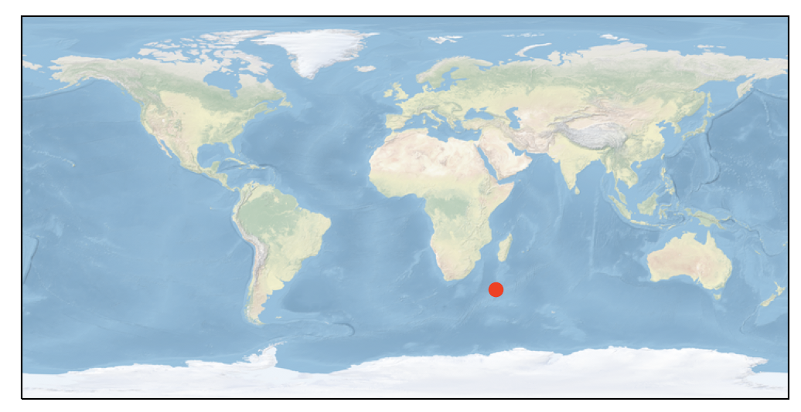
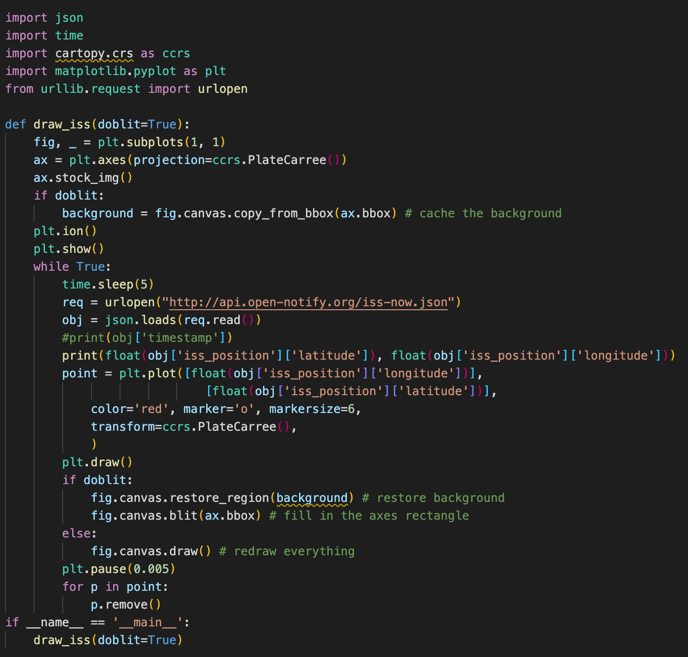

Writing a Python script to track and visualize the ISS


# Conda Environment

We will use the Cartopy library, available for Conda environments. This library allows us to project and transform appropriate mappings from coordinates and images.

``` bash
conda create --name iss_tracker
conda activate iss_tracker
conda install cartopy, matplotlib
```

Let's set up our script imports:

``` python
import json                               # For reading ISS info
import time                               # For reducing polling
import cartopy.crs as ccrs                # Mapping
import matplotlib.pyplot as plt           # Visualization
from urllib.request import urlopen        # Fetching ISS info
```

First, we want to set the environment we are going to be mapping in. For this, we use the Cartopy projection of PlateCarree which is synonymous to setting the extents of the coordinate mapping.

``` python
fig, _ plt.subplots(1,1)
ax = plt.axes(projection=ccrs.PlateCarree())
ax.stock_img()
plt.show()
```

Running this so far should show a plain map of Earth. Next we want to place a marker for the ISS. In order to do this, we want to fetch the location data of the ISS - luckily this is freely available via [Open-Notify](http://open-notify.org/Open-Notify-API/ISS-Location-Now/).

``` python
req = urlopen("http://api-open-notify.org/iss-now.json")
obj = json.loads(req.read())
```

This object contains a JSON object with a success/failure message, timestamp, and latitude and longitude of the ISS. To access this information, Python makes it easy once the json library has read it into dictionary format. Now we can plot an instance of the ISS into our map.

``` python
...
plt.plot([float(obj['iss_position']['longitude'])],
         [float(obj['iss_position']['latitude'])],
         color='red', marker='o', markersize=6,
         transform=ccrs.PlateCarree()
)
plt.show()
```

This should produce the following (given the current location of the ISS):



# Live Tracker

In order to implement a live tracker, we will have to call on some fancier functionalities of matplotlib and take care to remove old points otherwise our map will be overwhelmed if left too long.

In order to reduce redrawing efforts, we will cache the background by copying the current background from the figure.

``` python
background = fig.canvas.copy_from_bbox(ax.bbox)
```

We use this object later in the redrawing loop. Before we write the redrawing loop, we must enable drawing of the map in a non-blocking way - this is accomplished via plt.ion(). This enables the interactive mode for visualizations.

Inside the redrawing loop, we will move our ISS information request in and pass it into a 'point' object. After this step, we will redraw our plot.

In accordance with Open-Notify request, we will limit our polling rate to every 5 seconds to relieve burden from their servers - we will accomplish this by simply calling time.sleep(5).

``` python
while True:
    time.sleep(5)
    req = urlopen("http://api.open-notify.org/iss-now.json")
    obj = json.loads(req.read())
    
    point = plt.plot([float(obj['iss_position']['longitude'])],
                     [float(obj['iss_position']['latitude'])],
                      color='red', marker='o', markersize=6,
                      transform=ccrs.PlateCarree(),
)
plt.draw()
```

In order to utilize our cached background, we implement the blit functionality of matplotlib.

``` python
if doblit:
    fig.canvas.restore_region(background) # restore background
    fig.canvas.blit(ax.bbox) # fill in the axes rectangle
else:
    fig.canvas.draw() # redraw everything
plt.pause(0.005) # Allows rendering to catch up
```

Finally, in order to eliminate path streaks across our map, we will remove old coordination points - this is where that point object comes in.

``` python
for p in point:
    p.remove()
```

Now running this script will show off the live positioning for the ISS. The full code can be seen below.

# Full Script



# Sources
    
- [How do I plot in real-time in a while loop using matplotlib?](https://stackoverflow.com/questions/11874767/how-do-i-plot-in-real-time-in-a-while-loop-using-matplotlib)
- [Plotting in a non-blocking way with Matplotlib](https://stackoverflow.com/questions/28269157/plotting-in-a-non-blocking-way-with-matplotlib)
- [Cartopy](https://pypi.org/project/Cartopy/)
- [Open-Notify/ISS-Now](http://open-notify.org/Open-Notify-API/ISS-Location-Now/)

This article is also posted on Medium [here](https://levelup.gitconnected.com/iss-python-tracker-50222170f473).